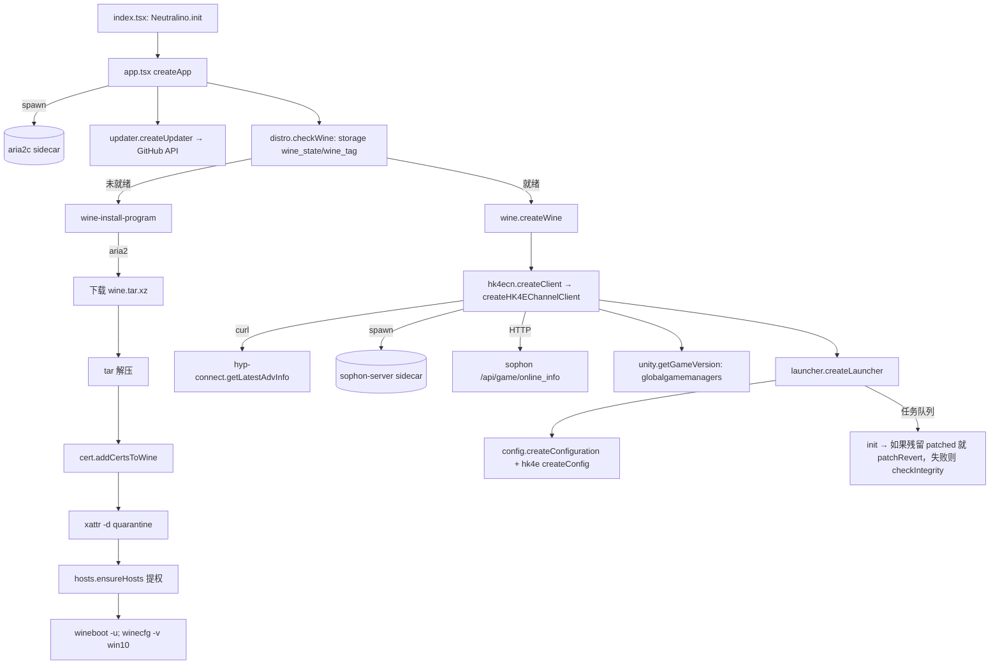

# hk4e 现状盘点（原神 CN / hk4ecn）

研究票：[#14](https://github.com/tanzby/yet-another-anime-game-launcher/issues/14)。所属地图：[#13 原生 macOS 迁移（原神 CN）](https://github.com/tanzby/yet-another-anime-game-launcher/issues/13)。

依据是 `origin/main` 的源码（f38cda4）。没有运行游戏或 App，所有结论都来自读代码。`file:line` 都相对仓库根目录。

## 1. 结论摘要

- **范围**：hk4ecn 实际打进包的 TS 约 62 个文件、约 7.1k 行（全仓库 TS 约 12.8k 行，不含 `neutralinojs.d.ts`）。另外还有 Python `sophon_server` 约 2.35k 行，`native/gamehost` 的 C/ObjC 约 0.77k 行（其中 dev 部分约 0.32k）。所以迁移面大约是 **7k 行 TS、2.3k 行 Python、0.45k 行 C（运行时部分）**。
- **运行时一共两个常驻 sidecar**：`aria2c`（启动时就拉起，负责下载 Wine、DXMT、ReShade 和自更新）和 `sophon-server`（hk4e 客户端创建时拉起，负责游戏安装、更新、预下载、校验和查版本）。`sophon-server` 自己再 fork `hpatchz`。另有一组**按需执行**的 x86_64 原生件：`yaagl-wine-shim` 被复制成 Wine loader，`yaagl-gamehost.dylib` 被注入游戏进程。这两个在 Rosetta 下的 Wine 里运行，**不可能链接进 arm64 的 Swift App**。
- **`sidecar/` 里有一半对 hk4ecn 是死的**：`xdelta3`（`server.patched` 为空）、`7zz`，以及顶层 `hpatchz`（TS 只在 bh3/hkrpg/nap 里调用它；sophon 用的是 nuitka 打进去的那份）。`protonextras` 中的 Windows PE 文件（steam.exe、lsteamclient.dll）每次启动都会复制进 prefix，属于数据文件，不是 sidecar。
- **外部进程大量走 shell**：Neutralino 的 `os.execCommand` 和 `spawnProcess` 用来调用 `curl`、`mv`、`cp`、`tar`、`unzip`、`md5`、`df`、`cmp`、`codesign`、`lsregister`、`xattr`、`osascript`（提权改 `/etc/hosts`）、`open`、`ps`、`lsof`、`kill`，以及各种 `wine`/`wineserver` 命令。这些多数可以用 Foundation 或系统 API 原生替换。**Wine 本身、`osascript … with administrator privileges` 以及 `codesign`/`lsregister` 仍然需要外部进程**。
- **对 hk4ecn 来说可以直接丢掉的 TS**：其他 9 个渠道的入口和 `mhy/{hkrpg,nap,bh3}`、`seasun/`，`mhy/program-check-integrity.ts`，`wine/mf.ts`，`downloadable-resource.ts` 里的 MoltenVK、DXVK、Jadeite，`unity.ts` 里两个未使用的函数，`patch.ts` 的 xdelta、added、hkrpg 分支，`hyp-connect.getLatestVersionInfo`，`wine.setNVExtension`、`wine.cmd`，`sophon.cancelOperation`，`promptUpdate`，`getMemoryInfo`，`sha1sum`，`hpatchz`/`7z` 相关工具函数，FPS 解锁设置（只存不读），Workaround #3 设置（UI 自己写着 "does nothing now"），`Server.hosts`/`cps`/`channel_id` 等字段，以及 `wine_netbiosname`、`wine_update_url` 这两个只写不读的键。详见 §7。
- **需要“行为等价”迁移的核心**：启动流程（§5.3），即 prefix 注册表、`config.bat`、DXMT 文件替换、steam.exe 注入、Game Mode 宿主、`/etc/hosts` 临时屏蔽，以及退出后的清理和回滚。另外还有 Sophon 的 HTTP/WS 协议所代表的能力（§5.2），以及 Neutralino storage 里的持久键（§6，“沿用数据目录”要靠它）。

## 2. 方法与度量

- `scc`、`cloc` 都没有安装，所以用 `wc -l` 统计行数。“可达文件”指从 `src/index.tsx` 出发、经过 `src/clients/index.ts → ./hk4ecn` 能 import 到的文件，即 `vite.config.ts:9-15` 的 channel-client switcher 在构建时把 `src/clients/index.ts` 替换成 `export * from './hk4ecn'`。
- 仓库里没有生产遥测，所以不做运行时画像（modernize-assess Step 4 跳过）。
- 相对规模指数（COCOMO-II 名义值 `2.94 × KSLOC^1.10`，**只用来比较大小，不代表工期或成本**）：TS 7.1 KSLOC 约 25.7；加上 Python 和 C，总计约 9.9 KSLOC，约 36.9。

## 3. 构建与打包（hk4ecn）

| 环节 | 位置 | 要点 |
|---|---|---|
| 选渠道 | `vite.config.ts:9-15` | 构建时用 `YAAGL_CHANNEL_CLIENT` 替换 `src/clients/index.ts`，其他渠道的代码不会进入 bundle |
| 打包 App | `build-app.js:19-24` | hk4ecn 用 `applicationId`（`com.3shain.yaagl`），`includeSophon = true` |
| 启动脚本 | `build-app.js:208-226` | `Contents/MacOS/parameterized`（bash）：用 md5 比较 `resources.neu`，再把 `Resources/` rsync 到 `~/Library/Application Support/Yaagl`，然后 `exec Yaagl --path=$APST_DIR`；通过 `PATH_LAUNCH` 传入 .app 路径，供重启使用 |
| sidecar | `build-app.js:241-264` | 复制 `sophon_server/build/server.dist` 到 `sidecar/sophon_server`，复制整个 `sidecar/`，再用 `native/gamehost/build.sh` 构建 gamehost |
| Sophon 构建 | `build-sophon.sh:2-27` | 把 `sidecar/hpatchz/hpatchz` 拷进去，用 protoc 生成 pb2，再由 nuitka standalone 打成 `sophon-server` |
| gamehost | `native/gamehost/build.sh:14-19` | `clang -arch x86_64` 编出 `yaagl-wine-shim` 和 `yaagl-gamehost.dylib`，并做 ad-hoc codesign |
| 发布 | `.github/workflows/build-ontag.yaml:82,98-99` | 只构建 hk4ecn：DMG、`Yaagl.app.tar.gz`、`resources_hk4ecn.neu` |
| Info.plist | `build-app.js:290-323` | `LSMinimumSystemVersion 10.15`，`NSAllowsArbitraryLoads` |

## 4. 模块清单（只列 hk4ecn 可达的模块）

| 领域 | 文件 | 职责 |
|---|---|---|
| 入口与壳 | `src/index.tsx`、`src/app.tsx` | 初始化 Neutralino，拉起 aria2，检查更新和 Wine 状态，然后进入 Launcher 或 Wine 安装界面 |
| 渠道定义 | `src/clients/hk4ecn.ts`、`src/clients/secret.ts`（由 `secret.b64` 解码） | `Server` 常量（URL、可执行文件名、数据目录、`removed` 列表），默认 Wine tag |
| hk4e 客户端 | `src/clients/mhy/hk4e/index.tsx` | 拉起 sophon，在线查版本，判断安装状态，实现 `ChannelClient` 的 install/update/predownload/launch/checkIntegrity/init/createConfig |
| hk4e 流程 | `mhy/hk4e/program-{install,update,check-integrity,launch}-game.ts` | install、update、校验都把进度从 Sophon WS 转成 UI 文案；launch 见 §5.3 |
| hk4e 设置 | `mhy/hk4e/config/*.tsx`（9 个） | HDR、W3、关闭补丁、Steam 补丁、屏蔽网络、分辨率、超时修复、Game Mode、MetalFX |
| mhy 共享 | `mhy/patch.ts`、`mhy/unity.ts`、`mhy/hyp-connect.ts`、`mhy/launcher-info.ts` | 启动前打补丁和回滚；从 `globalgamemanagers` 读版本；用 curl 拉背景；HYP 类型 |
| Sophon 客户端 | `src/sophon.ts` | 访问 `sophon-server` 的 HTTP 和 WebSocket |
| 下载 | `src/aria2.ts` | 通过 libaria2-ts WebSocket RPC 下载，用 `sha256_16(uri:dst)` 作 gid 实现续传 |
| Wine | `src/wine/{wine,distro,wine-install-program,cert,game-host}.ts` | Wine 执行封装，发行版列表，下载解压和 prefix 初始化，wine.inf 证书，Game Mode 宿主 |
| 附加资源 | `src/downloadable-resource.ts` | DXMT（每次启动都检查）、ReShade |
| 自更新 | `src/updater.ts`、`src/github.ts` | 查 GitHub latest release，下载 `resources_hk4ecn.neu` 和 `Yaagl.app.tar.gz` 里的 sidecar |
| hosts | `src/hosts.ts` | 安装 Wine 时提权重写 `/etc/hosts` 中 Yaagl 的那一段 |
| UI | `src/launcher/{index.tsx,task-queue.ts}`、`src/common-update-ui.tsx`、`src/config/*.tsx`、`src/accidental-complexity.ts` | 主界面、串行任务队列、设置弹窗、安装目录校验（只允许 ASCII，禁止 Desktop、Downloads、Documents） |
| 基础 | `src/utils/{neu,unix,helper,command-builder}.ts`、`src/constants/*`、`src/locale/*` | Neutralino API 封装，shell 命令拼接（`build()`），存储，本地化 |

## 5. 调用图

### 5.1 启动

关键位置：aria2 拉起在 `src/app.tsx:56-74`；Wine 分支在 `src/app.tsx:131-154`；sophon 拉起在 `src/clients/mhy/hk4e/index.tsx:84-96`；在线信息在 `index.tsx:98-104`；`init` 在 `index.tsx:290-304`，入队在 `src/launcher/index.tsx:108`。

### 5.2 安装、更新、预下载、校验（都经过 Sophon）

| 用户动作 | TS 入口 | Sophon 调用 |
|---|---|---|
| 安装到空目录 | `hk4e/index.tsx:152-180` → `program-install-game.ts:19-23` | `POST /api/install {gamedir, game_type:"hk4e", install_reltype:"cn"}`，然后 `WS /ws/{task}` |
| 选择已有目录 | `index.tsx:182-222` | 版本落后时只做登记；版本最新时执行 `POST /api/repair {repair_mode:"reliable"}` |
| 更新 | `index.tsx:232-257` → `program-update-game.ts:80-141` | 先在本地搬运 3.6 的音频目录（`/bin/cp -R`、`rm -rf`，`:93-136`），再 `POST /api/update {tempdir: <game>/.tmp, predownload:false}` |
| 预下载 | `index.tsx:224-231` → `program-update-game.ts:143-200` | `POST /api/update {predownload:true}`，然后写入 `predownloaded_all` |
| 校验 | `index.tsx:284-289` → `program-check-integrity.ts:13-17` | `POST /api/repair {repair_mode:"reliable"}` |

WS 事件类型：`job_start`、`chunk_progress`、`check_file`、`delete_file`、`ldiff_download_complete`、`delete_ldiff_file`、`job_end`、`job_error`/`error`（`src/sophon.ts:121-139`）。`config.ini` 由 Python 写入（`program-update-game.ts:140` 的注释；`sophon_server/sophon_api.py:380-396,1074-1077`）。

### 5.3 启动游戏（`launch`）

`hk4e/index.tsx:258-283`：如果开了 ReShade 就下载它；如果 `renderBackend == "dxmt"`（目前恒为真）就执行 `checkAndDownloadDXMT`；然后进入 `launchGameProgram`（`program-launch-game.ts:90-237`），顺序如下：

1. `wine.shutdown()` 清掉残留进程（`:108`；实现在 `src/wine/wine.ts:88-102`）。
2. `wine.setProps`：用 `cmd /c winedrv_config.bat` 写入 Mac Driver 的 RetinaMode 和 LeftCommandIsCtrl。开了 MetalFX 时强制关闭 Retina（`:112-116`；实现在 `wine.ts:163-181`）。
3. 可选：开了 HDR 时 `regedit hk4e_hdr_cn.reg`（`:117-119`）；自定义分辨率时生成 UTF-16LE 的 .reg 再 `regedit`（`:121-123`，`:48-88`）。
4. `wineserver -w`（`:124`）。
5. 生成 `config.bat`：复制 `HoYoKProtect.sys` 到 `%WINDIR%\system32`，`cd` 到游戏目录，用 `-platform_type CLOUD_THIRD_PARTY_PC -is_cloud 1` 启动游戏（`:126-135`）。
6. `patchProgram`（`src/clients/mhy/patch.ts:29-125`）：把 `removed` 列表里的 3 个文件改名为 `.bak`；把 Wine 自带的 d3d10core、d3d11、dxgi 换成 `./dxmt/` 里的版本，原文件改名为 `.bak`；复制 winemetal.dll/.so 到 Wine lib 和 system32；开了 ReShade 时复制 dxgi.dll 和 d3dcompiler_47.dll 到游戏目录；复制 steam64/32.exe 和 lsteamclient64/32.dll 到 system32/syswow64；最后 `setKey("patched","1")`。
7. 可选的“屏蔽网络”：把一个脚本写到 `/tmp/yaagl_network_block_script.sh`，再用 `osascript … with administrator privileges` 后台执行。脚本往 `/etc/hosts` 追加 `0.0.0.0 <CN_BLOCK_URL>`，`sleep 10` 后删掉（`:143-174`）。
8. Game Mode（默认开启）：`prepareGameHost`（`src/wine/game-host.ts:66-127`）。把 Wine 的 loader 改名为 `wine-host`，用 shim 顶替它；构建或更新 `YaaglGame.app`，对其 `codesign -i com.3shain.yaagl.game` 并 `lsregister -f`；返回 4 个 `YAAGL_GAME_HOST_*` 环境变量。
9. `wine.exec2`：以 `steam.exe <game exe>` 或 `cmd /c config.bat` 方式运行并等待退出（`:186-216`）。注意 **Steam 补丁打开时不会经过 `config.bat`**，也就不会复制 HoYoKProtect.sys、不会带 `-platform_type` 参数。
10. 退出后：`wineserver -w`，15 秒超时则 `shutdown()`（`:219`）；撤销 HDR 和分辨率的注册表项（`:220-225`）；删除 `config.bat`；执行 `patchRevertProgram`（`patch.ts:127-175`）。

## 6. 外部进程与 sidecar 清单

### 6.1 sidecar（App 自带的二进制）

| sidecar | 何时启动 | 参数与环境 | 对 hk4ecn |
|---|---|---|---|
| `sidecar/aria2/aria2c` | App 启动时，`src/app.tsx:57-74` | `-d / --no-conf --enable-rpc --rpc-listen-port=6868 --rpc-listen-all=true --rpc-allow-origin-all --input-file aria2.session --save-session aria2.session --pause true --stop-with-process <PPID>`；终止钩子里执行 `kill <pid>`（`:75-84`） | **在用**。下载 Wine、DXMT、ReShade 和自更新 |
| `sidecar/sophon_server/sophon-server` | hk4e 客户端创建时，`hk4e/index.tsx:88-92` | 环境变量 `TERMINATE_WITH_PID=<PPID>`、`SOPHON_PORT=<40000-65535 随机>`、`SOPHON_HOST=127.0.0.1`；uvicorn 在 `sophon_server/server.py:134-137`；psutil 每秒检查父进程，父进程消失就 SIGKILL 自己（`server.py:31-41`） | **在用** |
| ↳ `hpatchz`（打进 sophon 包内） | 更新应用 ldiff 时，`sophon_api.py:245-249` | `hpatchz -f <old> <切出来的 patch 临时文件> <dst>`，超时 50s，失败后以 300s 重试（`:1239-1242`） | **在用**（间接） |
| `sidecar/gamehost/yaagl-wine-shim` | 每次启动游戏前复制成 `<wine>/lib/wine/x86_64-unix/wine`（`game-host.ts:79-84`）；之后 Wine 每起一个 Windows 进程都会 exec 它 | 读取环境变量 `YAAGL_GAME_HOST_EXE/MATCH/DYLIB`；匹配到游戏 exe 时设置 `DYLD_INSERT_LIBRARIES` 并 exec `YaaglGame.app/Contents/MacOS/wine`（`native/gamehost/wine-shim.c:29-42`） | **在用**（Game Mode） |
| `sidecar/gamehost/yaagl-gamehost.dylib` | 由 shim 注入到游戏进程 | `YAAGL_GAMEHOST_LOG`；hook winemac 实现原生全屏和刘海区域、本机主机名解析（`native/gamehost/gamehost.c:1-17`） | **在用** |
| `sidecar/protonextras/*.exe/.dll` | 每次 `patchProgram` 时复制进 prefix（`patch.ts:105-122`） | 只在 Steam 补丁打开时被执行（作为 Wine 进程） | **在用**（数据文件） |
| `sidecar/xdelta/xdelta3` | `utils/unix.ts:18-31`，只被 `patch.ts:46` 调用 | hk4ecn 的 `patched: []`（`src/clients/hk4ecn.ts:38-49`），所以永远不会执行 | **死** |
| `sidecar/7z/7zz` | `utils/unix.ts:118-199`，只有 hkrpg/bh3 调用 | — | **死** |
| `sidecar/hpatchz/hpatchz`（顶层） | `utils/unix.ts:33-45`，只有 bh3/hkrpg/nap 调用；`build-sophon.sh:2` 构建时拷进 sophon | — | 运行时**死**，只作为构建输入 |

### 6.2 Wine 进程（全部带 `WINEPREFIX=<data>/wineprefix` 和 `WINEDEBUG=fixme-all,err-unwind,+timestamp`，见 `wine.ts:120-125`）

| 命令 | 时机 | 位置 |
|---|---|---|
| `wine wineboot -u`、`wine winecfg -v win10` | 安装 Wine 时 | `wine-install-program.ts:89-90` |
| `wine cmd /c winedrv_config.bat` | 每次启动游戏前 | `wine.ts:174-180` |
| `wine regedit <reg>` | 启动前和退出后（HDR、分辨率） | `program-launch-game.ts:42,84,265,295` |
| `wine cmd /c config.bat` 或 `wine C:\windows\system32\steam.exe <game.exe>` | 启动游戏 | `program-launch-game.ts:186-216` |
| `wineserver -w` / `-k` | 启动前、退出后、setProps 之后 | `wine.ts:73-114` |
| `osascript → Terminal: wine cmd` | 设置 →“打开命令行” | `wine.ts:127-153`、`config/index.tsx:233` |

游戏进程的环境变量（`program-launch-game.ts:191-213`）：`MTL_HUD_ENABLED`、`WINEDLLOVERRIDES=""`、`WINE_ENABLE_TIMEOUT_FIX`、`WINEESYNC=1`、`DXMT_LOG_PATH`、`DXMT_CONFIG=d3d11.preferredMaxFrameRate=60;`、`DXMT_CONFIG_FILE=<data>/dxmt.conf`、`DXMT_METALFX_SPATIAL_SWAPCHAIN`、`GST_PLUGIN_FEATURE_RANK=atdec:MAX,avdec_h264:MAX`，开了代理时加 `HTTP(S)_PROXY`，开了 Game Mode 时加 `YAAGL_GAME_HOST_*` 和 `YAAGL_GAMEHOST_LOG`。

### 6.3 其他系统命令（都经过 `utils/neu.ts:19-37` 的 `exec`，再由 Neutralino `os.execCommand` 交给 shell）

| 命令 | 用途 | 位置 | Swift 替代 |
|---|---|---|---|
| `echo $PPID` | 取 Neutralino 进程的 pid | `app.tsx:56`、`hk4e/index.tsx:87` | `getpid()` |
| `curl <adv_url>` | 拉 HYP 背景 | `mhy/hyp-connect.ts:13-20` | URLSession |
| `mv -f`、`cp -p`、`rm -rf`、`mkdir -p`、`/bin/cp -R` | 文件操作 | `utils/neu.ts:188-208`、`utils/unix.ts:47-49`、`program-update-game.ts:109-134` | FileManager |
| `tar -Jxvf/--strip-components`、`tar -xvf`、`unzip`、`sh -c mv` | 解压 Wine、DXMT、ReShade | `utils/neu.ts:104-124`、`downloadable-resource.ts:174-206`、`utils/unix.ts:52-116` | 可链接 libarchive 或保留 `/usr/bin/tar` |
| `/usr/bin/xattr -s -r -d com.apple.quarantine`（提权） | 去掉 Wine 的隔离属性 | `utils/unix.ts:5-11`、`wine-install-program.ts:77` | `removexattr`（需要确认是否真要提权） |
| `osascript … with administrator privileges` | 重写 `/etc/hosts`（安装时）、临时屏蔽 hosts（启动时） | `hosts.ts:28`、`utils/neu.ts:88-102`、`program-launch-game.ts:165-173` | 仍需外部提权（`AuthorizationExecuteWithPrivileges` 已废弃；SMAppService 特权 helper 需要签名） |
| `md5 -q`、`df -g` | 校验、剩余空间 | `utils/unix.ts:13-16,201-215`、`hk4e/index.tsx:156` | CryptoKit、`URLResourceValues.volumeAvailableCapacity` |
| `cmp -s`、`codesign -f -s - -i …`、`lsregister -f` | 构建 Game Mode 宿主 .app | `game-host.ts:25-32,102,115` | `codesign` 和 `lsregister` 仍需外部进程（或用 `LSRegisterURL`） |
| `sh -c` + `ps`/`lsof`/`awk`/`xargs kill -9` | 清理 prefix 的残留进程 | `wine.ts:94-101` | `proc_listpids`、`proc_pidinfo` |
| `open <dir>`、`open "$PATH_LAUNCH"` | 打开目录、重启自身 | `config/index.tsx:244,258`、`utils/neu.ts:382-385` | NSWorkspace |
| `kill <aria2 pid>` | 退出时 | `app.tsx:79` | 不再需要（aria2 会被替换） |

## 7. 持久状态（沿用数据目录要兼容的部分）

数据目录是 `~/Library/Application Support/Yaagl`（`build-app.js:211-226`），其中：

- `.storage/`：Neutralino storage（`build-app.js:122-130` 预建）。读写都通过 `utils/neu.ts:139-156`。hk4ecn 用到的键如下：
  - 安装与版本：`game_install_dir`、`patched`、`predownloaded_all`、`ignore_launcher_update`、`singleton`
  - Wine：`wine_state`、`wine_tag`、`wine_update_tag`、`wine_update_url`（只写不读）、`wine_netbiosname`（只写不读）
  - 资源版本：`installed_dxmt_version`、`installed_reshade`
  - 设置：`config_uiLocale`、`config_metalHud`、`config_retina`、`left_cmd`、`config_proxyEnabled`、`config_proxyHost`、`config_advanced`、`config_fps_unlock`、`config_reshade`、`config_hk4e_enable_hdr`、`config_workaround3`、`config_patch_off`、`config_steam_patch`、`config_block_net`、`config_resolution_{custom,width,height}`、`config_timeout_fix`、`config_game_mode`（默认 true）、`config_metalfx_upscale`
- `wine/`（运行时，其中 loader 已被 shim 替换，并有 `wine-host`），`wineprefix/`，`dxmt/`，`reshade/`，`YaaglGame.app/`，`logs/`（`game_*.log`、`gamehost.log`），`aria2.session`，`resources.neu`，`sidecar/`，`.bundle-stamp`，`dxmt.conf`（可选），`sidecar/sophon_server/gametemp`（`sophon_server/tasks.py:188`）。
- 游戏目录里：`config.ini`（Sophon 写）、`.tmp/`（更新临时目录）、启动期间的 `*.bak`、ReShade 的 `ReShade.ini`。

## 8. 对 hk4ecn 是死代码的部分（迁移时可以不管）

**构建期就被排除的**（`vite.config.ts:9-15`）：`src/clients/{hk4eos,hk4euniversal,hkrpgcn,hkrpgos,bh3glb,napcn,napos,cbjq,cbjqcn}.ts`、`src/clients/mhy/{hkrpg,nap,bh3}/`、`src/clients/seasun/`、`src/clients/mhy/program-check-integrity.ts`（只有 bh3/hkrpg/nap import 它）。另外 `src/constants/cpu_db.ts` 没有被任何文件 import。

**会打进 bundle，但对 hk4ecn 永远不会执行的**：

| 代码 | 原因 |
|---|---|
| `wine/mf.ts`、`wine-install-program.ts:101-107` | 只有 bh3、cbjq 会执行 |
| `downloadable-resource.ts:25-131`（MoltenVK、DXVK、Jadeite） | 没人调用；`hk4e/index.tsx:39` 的 import 也没用上 |
| `patch.ts:39-53,60-63,140-146,152-156`（xdelta 补丁、`added`）、`putLocal` | `patched`、`added` 都为空（`hk4ecn.ts:38-49,65`） |
| `patch.ts:89-95`、`patch.ts:105`（hkrpg 分支） | `server.id` 是 `hk4e_cn` |
| `patch.ts:40,55` 和 `hk4e/config/workaround-3.tsx` | 没有带 `workaround3` tag 的条目，UI 文案写着 "does nothing now"（`workaround-3.tsx:57`） |
| `unity.ts:25-84`（`getGameVersion2019`、`disableUnityFeature`） | 没人调用；`patch.ts:21` 的 import 也没用上 |
| `hyp-connect.ts:51-60`（`getLatestVersionInfo`） | 版本信息改由 Sophon 提供 |
| `program-launch-game.ts:56-60,145`、`:249-253,277-281` 的 `hk4e_global` 分支，`HDR_REGISTRY_FILES.hk4e_global` | 只适用于 OS 服 |
| `program-launch-game.ts:205-207`、`patch.ts:160` 的非 DXMT 分支 | 所有发行版的 `renderBackend` 都是 `"dxmt"`（`wine/distro.ts:17-78`） |
| `wine.ts:31-33`（`cmd`）、`wine.ts:183-198`（`setNVExtension`）、`wine.ts:155-161`（netbiosname 只生成不使用） | 没人调用 |
| `sophon.ts:179-188`（`cancelOperation`） | 没人调用，UI 不能取消任务 |
| `utils/unix.ts:18-45,118-199`（xdelta3、hpatchz、7z），`utils/neu.ts:215-245,327-346`（`promptUpdate`、`getMemoryInfo`、`sha1sum`），`locale/index.ts:71-80` | 没人调用（或只有其他渠道调用） |
| `config/fps-unlock.tsx` | 只写 `config_fps_unlock`，启动流程从不读取 |
| 高级设置页（FPS、ReShade） | `YAAGL_ADVANCED_ENABLE` 在发布构建里没有设置（`constants/version.ts:6-7`；`build-ontag.yaml` 不设置它），这一页根本打不开，所以 `config.reshade` 实际恒为默认 false，除非旧版本存过这个键 |
| `updater.ts:30-39,52-69,117-123` | 只有 hk4ecn 会用到 `Yaagl.app.tar.gz`；`YAAGL_OS` 和 hk4euniversal 分支是死的 |
| `Server` 的 `hosts`、`cps`、`channel_id`、`subchannel_id`、`THE_REAL_COMPANY_NAME`、`product_name`、`update_url` 字段（`constants/server.ts`） | hk4ecn 路径没有读取它们（`update_url` 只给死函数 `getLatestVersionInfo` 用） |
| `hk4ecn.ts:23-24`（`DEFAULT_WINE_DISTRO_URL`）、`hk4ecn.ts:3-4` 的注释 | 没人用 |
| `launcher/index.tsx` 中 `iconImage`、`logo`、`launchButtonLocation` 的分支 | hk4e 的 `uiContent` 不提供这些字段（`hk4e/index.tsx:141-146`） |
| `wine_update_url` 键 | 只写（`config/index.tsx:192-195`、`config/wine-distribution.tsx:86`），从不读取 |

## 9. 技术债与风险（迁移时值得顺手修，或刻意保留）

1. **Bug：`hyp-connect.ts:29` 判断 `server.id == "CN"`，永远为假**。所以 CN 服背景请求带的是 UI 语言的 `CONTENT_LANG_ID`，而不是 `zh-cn`。
2. **Bug：分辨率高度默认值是 `"1920"`**（`hk4e/config/resolution.tsx:162`），应该是 1080。
3. **Steam 补丁打开时会绕过 `config.bat`**（`program-launch-game.ts:186-190`）：不复制 HoYoKProtect.sys，也不带云平台参数。迁移时需要确认这是有意为之。
4. **`patchProgram` 不管 `renderBackend`，总是替换 DXMT 文件**；而 revert 只在 dxmt 时恢复（`patch.ts:69-73` 对比 `:160`）。目前所有发行版都是 dxmt，所以没问题。
5. **大量 shell 字符串拼接**（`utils/command-builder.ts` 的 `build()` 和 `rawString`）。`program-launch-game.ts:144-173` 在 `/tmp` 写脚本，再以 root 执行 `source`：路径固定且可预测，存在本地提权下的 TOCTOU 风险（CWE-377/CWE-367）。
6. **aria2 RPC 带 `--rpc-listen-all=true --rpc-allow-origin-all`，而且没有 secret**（`app.tsx:63-65`）：局域网内任何人都能指挥 aria2 往任意路径写文件（CWE-306）。Swift 用 URLSession 替换后，这个问题自然消失。
7. **sophon-server 的 HTTP/WS 没有鉴权**，只监听 127.0.0.1 的随机端口，但本机其他进程都能调用它。
8. **`xattr` 去隔离属性走了 sudo**（`utils/unix.ts:6-10` 第三个参数是 `true`），每次装 Wine 都会弹管理员密码框。`ensureHosts` 也一样（`hosts.ts:28`）。
9. **任务队列里出错一律 `fatal()` 退出整个 App**（`launcher/task-queue.ts:31-34`），没有可恢复的错误。
10. **Neutralino storage 是“每个键一个 JSON 文件”的格式**。原生 App 要沿用数据目录，就要读它；或者做一次迁移。

## 10. 对迁移的含义

- “sidecar 全部替换”可以覆盖 aria2c、sophon-server（含 hpatchz，可以把 HDiffPatch 作为 C target 链接）、xdelta、7z，以及 §6.3 里大部分 shell 命令。
- **替换不了的外部进程**：Wine（`wine`、`wineserver`，x86_64，运行在 Rosetta 下）；`yaagl-wine-shim` 和 `yaagl-gamehost.dylib`（必须是 x86_64，与 Wine 同一架构；dylib 要注入 Wine 进程，不能链接进 arm64 App）；`osascript` 提权改 `/etc/hosts`；`codesign`、`lsregister`（后者可以改用 `LSRegisterURL`）。
- protonextras 中的 PE 文件需要作为资源继续随 App 分发。
- `config.ini`、`.tmp`、ldiff 流程和 `sophon_api.py` 的版本判定规则（`sophon_api.py:459-480`，取 config.ini 和 globalgamemanagers 中较小的版本）是 Sophon Swift 重写时需要提取的业务规则。

## 来源

全部来自本仓库源码（`origin/main` f38cda4），引用见正文的 `file:line`。没有用到外部资料。
